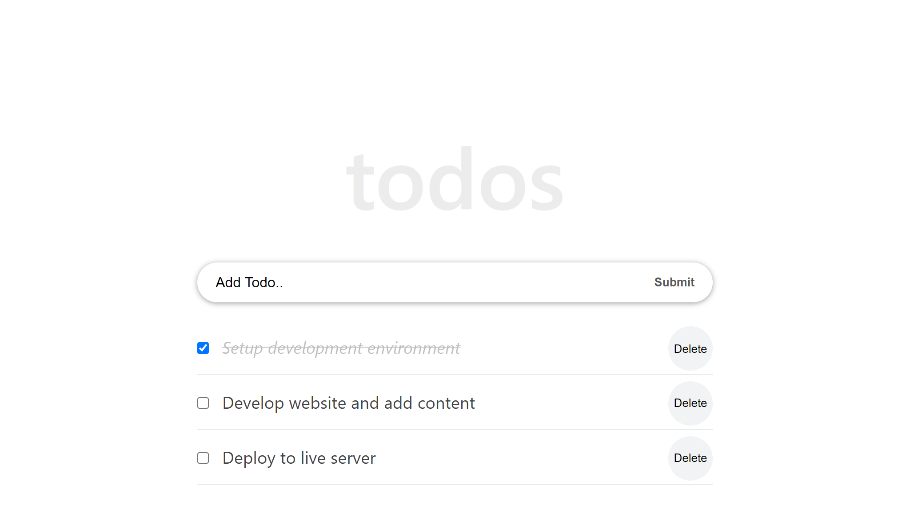

#  React Tutorial From Scratch: A Step-by-Step Guide (2021)

> Set up project for a todo list with React 




## Built With

-React
-webpack
-node.js

## Getting Started

after cloning

```
npm install
npm start
```
## Authors

👤 **Emirjeta Veisllari**

- GitHub: [@myelin0](https://github.com/myelin0)
- Twitter: [@Amy_Albania](https://twitter.com/Amy_albania)
- LinkedIn: [@Emirjeta Veisllari](https://www.linkedin.com/in/emirjeta-veisllari/)
## 🤝 Contributing

Contributions, issues, and feature requests are welcome!

Feel free to check the [issues page](https://github.com/myelin0/React-tutorial/issues).

## Show your support

Give a ⭐️ if you like this project!

## Acknowledgments

Ibaslogic.com

## 📝 License

This project is [MIT](./MIT.md) licensed.
